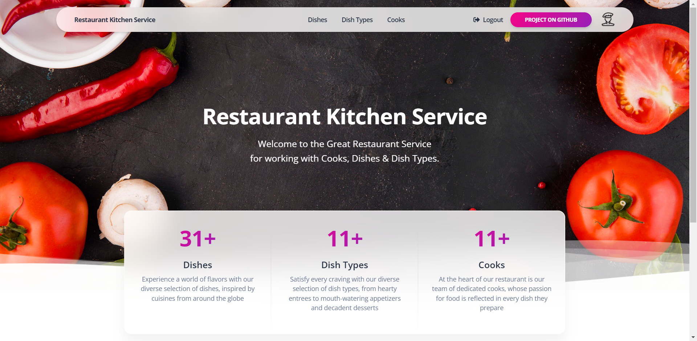

# Restaurant Kitchen Project

Django Project for managing Cooks, Dishes & Dish Types

## Check it out!
[Restaurant Kitchen project deployed to render](https://restaurant-kitchen-service-vd6z.onrender.com)

## Installation

Python3 must be already installed

```shell
git clone https://github.com/arsenmakovei/restaurant-kitchen-service.git
cd restaurant_kitchen_service
python3 -m venv venv
source venv/bin/activate (on macOS)
venv\Scripts\activate (on Windows)
pip install -r requirements.txt 
python manage.py runserver # Starts Django Server
```

## Features
* Authentication for Cook/User
* Managing Cooks, Dishes & Dish Types directly from the website interface
* Powerful admin panel for advanced managing

## Demo

```
username: guest
passord: guest123
```


